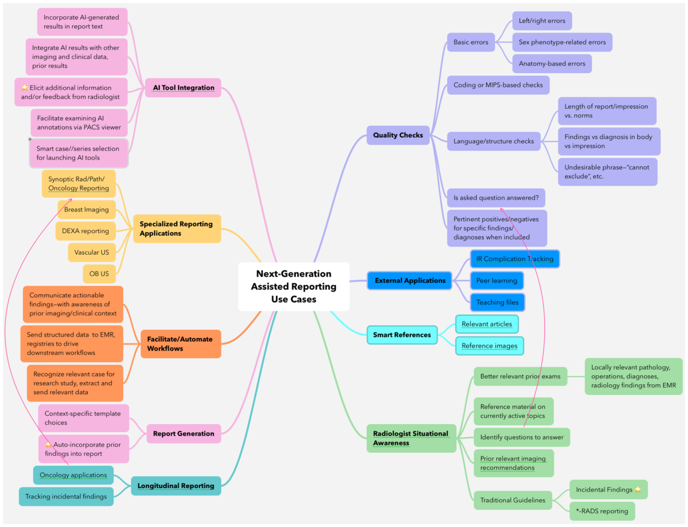

# Index of Potential Use Cases

Going to be a living list of ideas for use cases. Can start as just a name and description in this list; as ideas mature, they can move into separate files which can be linked from this file. 

See [README.md](README.md) for explanation of the value categories in parentheses after descriptions.

## Workflow/Worklist Use Cases
-**Applying prior DEXA scan data**: When tech runs current DEXA scan, previously excluded levels would automatically be excluded on current study.  This could also be passed downstream to the dictation software with reason from prior report.

## Protocoling System Use Cases

## AI Pipeline Use Cases

## Assisted Reporting Use Cases

- **Stroke** (RSNA RepIC): Automated communication to stroke team when findings of stroke are reported (2,3)
- **Problem list update** (RSNA RepIC): Findings in radiology report automatically update EMR problem list (3)
- **Add information to ACR GRID registry**: Findings in radiology report automatically populate fields in ACR GRID registry (1,3)
- **Add information to public health infectious disease database** (RSNA RepIC): Impressions from radiology reports combine with other EMR data to add to a public health database (1,5)
- **Testicular torsion**: Automated communication to urology team when findings of testicular torsion are reported (2,3)
- **Prior Comparison/Retrieve Problem List** (RSNA RepIC): Findings from prior radiology reports (including incidentals) are compiled into a list for the reporting radiologist to review while dictating a new report (1,2,3)
- **DVT/PE** (RSNA RepIC): Generation of message to the primary care team to order anticoagulation when findings of DVT or PE are reported (2,3)
- **Follow-up Manager** (RSNA RepIC): Automated compilation of incidental finding follow-up recommendations based on report “impression” or “recommendations” sections, triggering reminder/prompts to ordering physicians. Optional: Retrieve follow-up recommendations from prior reports and compile list for reporting radiologist to determine if the study was performed in the interim. If the study was performed, potentially also summarize any resulting diagnoses based on imaging or subsequent biopsy. (2,3)
- **Report Summary/Action List** (RSNA RepIC): List of actionable items based on findings to guide the ordering team on next steps for acute and incidental findings (2,3)
- **Organ/body part auto-update** (RSNA RepIC): Radiology report automatically updates with post-surgical or congenital absent organs/body parts based on EMR (1,3)
- **Practice Guideline Template Manager** (RSNA RepIC): Template manager for common/accepted x-RADS (BI-RADS, TI-RADS, LI-RADS, CAD-RADS, etc) to encourage common reporting of practice guidelines (can include “layperson” translation of categories) (optional – accompanying CDE sets to encode guidelines for “machine readable” component). Goal is to simplify downstream clinical and research consumption, potentially standardizing reporting within and across sites. (1,2,3,4)
- **Reason for exam** (RSNA RepIC): Standardization of reason for exam in radiology reports (potentially in an automated fashion) and encoding of this information as machine-readable metadata. Goal to simplify reporting of this data and downstream clinical and research consumption. (1,3,4,5,6)
- **Reason for exam—complex/detailed** (RSNA RepIC): This could be considered contrary to the prior entry, but it can be argued that it is not. An oncologist, orthopedic surgeon or other specialist may be attempting to answer a very specific question. Given that there may be a 50 or 80 char limit for “reason for exam,” how does the radiologist (1) know exactly what the most important question is and (2) how/where is that conveyed? Might there be a “gross reason for exam” and a “very specific reason for exam”? Or, perhaps it is not “reason for study,” but indications, background, history, or some other element. Clinical use case: “DDx: suspect lymphoma, immunosuppressed patient” (2,3)
- **Export report to research database** (RSNA RepIC): Primary findings and numeric measurements from radiology reports need to be exported as structured, coded data so that the information is searchable and measurable. Example of this is to be able to export measurements of (identified to be the same) lymph nodes over time to an OMOP database. A more complex example would be tumor tracking during treatment export to an OMOP research database. (3,4,5)
- **Implanted devices** (RSNA RepIC): Automatic population of implanted devices, including those placed intentionally and unintentionally. This may be used for pre-procedure screening and protocolling (MRI,CT), as well as reporting (ICU Chest films) and allow reconciliation of unexpected or missing items. (1,2,3)

## PACS Viewing Use Cases

## Data Exploration Use Cases

## Uncategorized Use Cases
-Spine numbering with transitional anatomy- Reference previous labeling automatically, or similar to production of lay report, create report with alternative numbering based on spine surgeon preference (need to look at medical legal issues here), could also get info from surgeon report for feedback on spine numbering (pop up to radiologist “would you like schema A or schema B?”)

-Comparison cases- RCC or Melanoma have highly variable appearance, system could potentially use terms in report someone is dictating to find similar cases to boost confidence in diagnosis, would be more powerful if could have access to data from multiple other sites, also could help teach trainees, or overnight/urgent care staff that has to wait for formal radiology read in the morning

-Auto-populate current and prior measurements for CT/MR angiography of the thoracic aorta to be able to indicate interval change without a lot of manual steps. Correctly classify as normal/dilated/aneurysm, etc. Same for abdominal aorta.

-Trainee Teaching file/case search/research/literature search

-Biopsy/scan follow up

-Tie in with SWIM initiative

-Populate PowerScribe findings mode dictionary 

-Surg/imaging/path correlation- Currently a fairly manual process (imaging report comparing with op notes), with CDE could automate and more easily find discordant cases for feedback and improvement

-Reduce laterality issues/body part with orders- intake staff order may be contralateral to the progress note (or order a foot when they wanted an ankle), can flag this and potentially reduce phone calls/confusion before it gets to the level of the radiologist

-Cross reference EMR for data to support imaging finding- example non contrast ct chest blood pool less dense than cardiac muscle would indicate anemia, system could then verify last H&H and drop that information in helping to support the imaging finding

